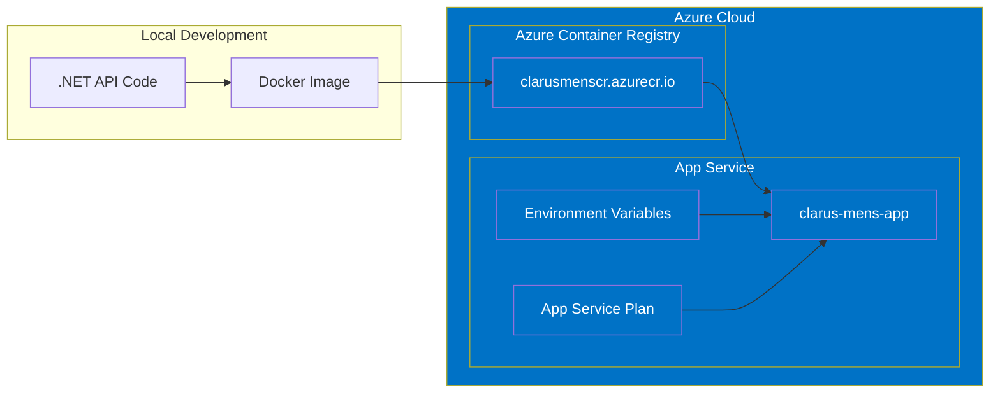
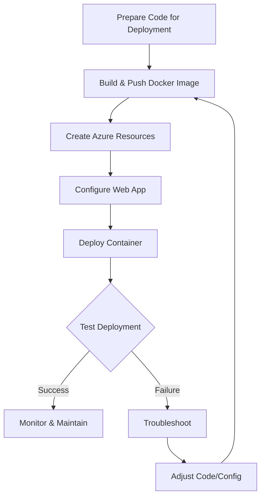
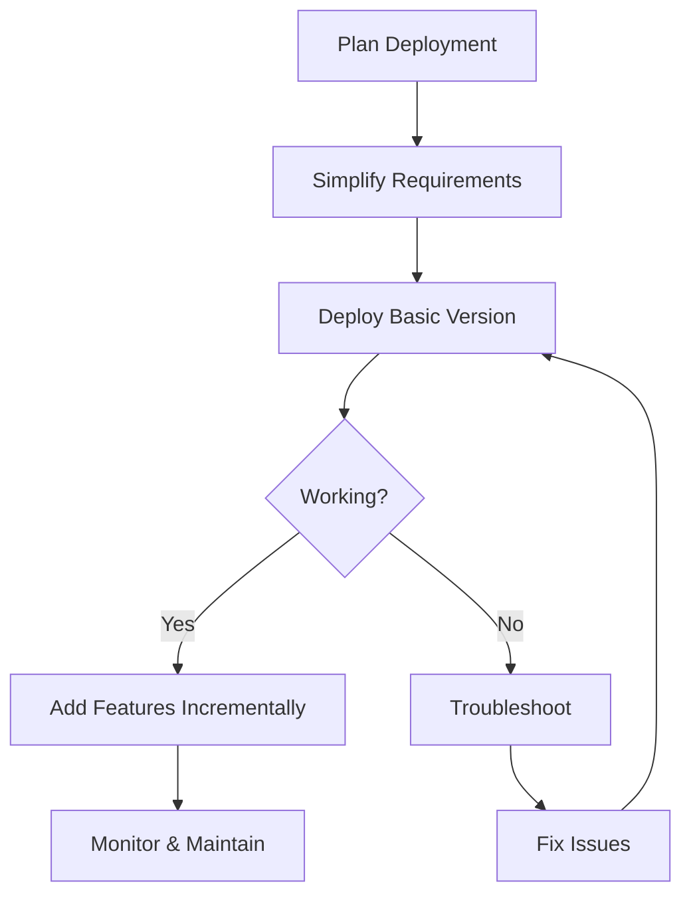

# Azure Deployment Walkthrough: Clarus Mens API

> **Note**: This document describes the actual implementation and deployment process we
> followed with our specific challenges and solutions. For theoretical background and
> planning information, see [Azure Deployment Planning Guide](azure-deployment-planning-guide.md).

## Table of Contents

- [Table of Contents](#table-of-contents)
- [Overview](#overview)
- [Project Structure](#project-structure)
- [Deployment Strategy](#deployment-strategy)
- [Prerequisites](#prerequisites)
- [Step 1: Setting Up Azure Resources](#step-1-setting-up-azure-resources)
  - [Creating a Resource Group](#creating-a-resource-group)
  - [Creating Azure Container Registry](#creating-azure-container-registry)
- [Step 2: Building and Pushing Docker Image](#step-2-building-and-pushing-docker-image)
  - [Building the Docker Image](#building-the-docker-image)
  - [Pushing to Azure Container Registry](#pushing-to-azure-container-registry)
- [Step 3: Setting Up Azure App Service](#step-3-setting-up-azure-app-service)
  - [Creating an App Service Plan](#creating-an-app-service-plan)
  - [Creating a Web App](#creating-a-web-app)
- [Step 4: Configuring the Web App](#step-4-configuring-the-web-app)
  - [Container Settings](#container-settings)
  - [Application Settings](#application-settings)
- [Step 5: Code Adaptations for Azure](#step-5-code-adaptations-for-azure)
  - [Required Code Changes](#required-code-changes)
  - [Building and Deploying Updated Code](#building-and-deploying-updated-code)
- [Troubleshooting](#troubleshooting)
  - [Container Startup Issues](#container-startup-issues)
  - [Configuration Problems](#configuration-problems)
  - [Logging and Diagnostics](#logging-and-diagnostics)
- [Maintenance and Updates](#maintenance-and-updates)
  - [Updating the Application](#updating-the-application)
  - [Monitoring](#monitoring)
- [Cost Considerations](#cost-considerations)
- [Lessons Learned](#lessons-learned)

## Overview

This walkthrough documents our actual process of deploying the Clarus Mens .NET API to
Microsoft Azure using Docker containers. It provides step-by-step instructions from initial
setup to successful deployment, including troubleshooting the issues we encountered.



## Project Structure

The Clarus Mens API is a .NET 9 Minimal API project with the following key components
relevant to deployment:

- **ClarusMensAPI/Program.cs**: Main entry point and configuration
- **ClarusMensAPI/Configuration/**: Configuration classes and settings management
- **ClarusMensAPI/Extensions/**: Service registration and middleware setup
- **ClarusMensAPI/Endpoints/**: API endpoint definitions
- **Dockerfile**: Container definition for Docker-based deployment
- **appsettings.json**: Base configuration settings
- **appsettings.{Environment}.json**: Environment-specific overrides

The project includes Azure-specific configurations in `ApiConfiguration.cs`, particularly
for settings like KeyVault integration and Application Insights, along with proper health
checks configured for container health monitoring.

## Deployment Strategy

Our deployment strategy follows these principles:

1. **Container-based deployment** for consistency across environments
2. **Simplified initial deployment** focusing on core functionality
3. **Incremental refinement** through testing and troubleshooting
4. **Environment-specific configuration** using Azure's application settings



For the initial deployment, we simplified by:

- Omitting Azure KeyVault integration
- Focusing on a single environment configuration
- Deferring database integration
- Retaining Docker for deployment consistency

## Prerequisites

Before starting the deployment process, ensure you have:

- Active Azure subscription
- .NET 9 SDK installed
- Docker Desktop installed and running
- Azure CLI installed
- PowerShell 7+ or Git Bash
- Proper authentication to Azure

## Step 1: Setting Up Azure Resources

### Creating a Resource Group

**Intent**: Create a container to organize all Azure resources for the project.

**Prerequisites**:

- Azure CLI installed and authenticated
- Active Azure subscription

**Command**:

```powershell
# Create a resource group in West Europe (closest to Germany)
az group create --name clarus-mens-rg --location westeurope
```

**Expected Result**: A resource group named "clarus-mens-rg" is created in the West Europe
region.

**Cost Considerations**: Resource groups themselves don't incur costs, but resources within
them do.

### Creating Azure Container Registry

**Intent**: Create a private registry to store our Docker images.

**Prerequisites**:

- Resource group created

**Command**:

```powershell
# Create a basic Azure Container Registry
az acr create --resource-group clarus-mens-rg --name clarusmenscr --sku Basic \
  --admin-enabled true
```

**Expected Result**: A container registry named "clarusmenscr" is created.

**Notes**:

- Registry names must be globally unique
- Only lowercase letters, numbers, and hyphens allowed
- Cannot contain hyphens at start/end
- Must be 5-50 characters long

**Output Example** (abbreviated):

```json
{
  "adminUserEnabled": true,
  "creationDate": "2025-03-30T20:35:48.748299+00:00",
  "loginServer": "clarusmenscr.azurecr.io",
  "name": "clarusmenscr",
  "provisioningState": "Succeeded",
  "resourceGroup": "clarus-mens-rg",
  "sku": {
    "name": "Basic",
    "tier": "Basic"
  }
}
```

**Lesson Learned**: Registry names need careful planning as they must be globally unique
and follow naming restrictions.

**Cost Considerations**: Basic tier costs approximately €4.82/month with 10GB storage
included.

## Step 2: Building and Pushing Docker Image

### Building the Docker Image

**Intent**: Create a Docker image of our application for deployment.

**Prerequisites**:

- Dockerfile in project root
- Docker Desktop running
- Project built successfully locally

**Command**:

```powershell
# Build the Docker image with a tag for Azure Container Registry
docker build -t clarusmenscr.azurecr.io/clarus-mens:v1 .
```

**Expected Result**: A Docker image is built and tagged for our registry.

**Notes**:

- The dot at the end specifies current directory as build context
- Tag format is `<registry-name>.azurecr.io/<image-name>:<tag>`
- Use versioned tags (v1, v2) for easier rollback

### Pushing to Azure Container Registry

**Intent**: Upload our Docker image to Azure Container Registry.

**Prerequisites**:

- Docker image built
- Azure Container Registry credentials

**Commands**:

```powershell
# Get the registry credentials
az acr credential show --name clarusmenscr

# Log in to the container registry
az acr login --name clarusmenscr

# Push the image to Azure Container Registry
docker push clarusmenscr.azurecr.io/clarus-mens:v1
```

**Expected Result**: The Docker image is pushed to Azure Container Registry.

**Notes**:

- The registry provides two passwords for credential rotation
- Either password can be used for authentication
- Store credentials securely

**Lesson Learned**: Having two passwords allows for secure credential rotation without
downtime.

## Step 3: Setting Up Azure App Service

### Creating an App Service Plan

**Intent**: Create the hosting environment for our web application.

**Prerequisites**:

- Resource group created
- Microsoft.Web provider registered

**Commands**:

```powershell
# Register the Microsoft.Web provider if not already registered
az provider register --namespace Microsoft.Web

# Check registration status
az provider show -n Microsoft.Web --query registrationState

# Create an App Service plan (B1 tier for container support)
az appservice plan create --name clarus-mens-plan --resource-group clarus-mens-rg \
  --sku B1 --is-linux
```

**Expected Result**: An App Service plan with Linux OS and B1 tier is created.

**Notes**:

- B1 is the minimum tier that supports custom containers
- Free/Shared tiers don't support containers
- Linux is required for our container

**Lesson Learned**: New Azure subscriptions may need provider registration before creating
certain resources.

**Cost Considerations**: B1 tier costs approximately €12.41/month.

### Creating a Web App

**Intent**: Create a container-based web app to host our API.

**Prerequisites**:

- App Service plan created
- Docker image pushed to ACR

**Command**:

```powershell
# Create a Web App with container configuration
az webapp create --resource-group clarus-mens-rg --plan clarus-mens-plan \
  --name clarus-mens-app --deployment-container-image-name clarusmenscr.azurecr.io/clarus-mens:v1
```

**Expected Result**: A web app is created that will pull and run our container image.

**Notes**:

- Web app name must be globally unique
- Creates the app's default domain: <https://clarus-mens-app.azurewebsites.net>

**Lesson Learned**: Web app names need careful planning as they must be globally unique and
form part of the public URL.

## Step 4: Configuring the Web App

### Container Settings

**Intent**: Configure the web app to use our container image with proper authentication.

**Option 1: Using the Azure Portal**:

1. Navigate to the Azure Portal at [https://portal.azure.com](https://portal.azure.com)
2. Search for "App Services" in the search bar
3. Select your web app: "clarus-mens-app"
4. In the left sidebar, find "Settings" section and click on "Environment variables"
5. Under the "Application settings" tab, add or verify the following settings:
   - DOCKER_REGISTRY_SERVER_URL = <https://clarusmenscr.azurecr.io>
   - DOCKER_REGISTRY_SERVER_USERNAME = clarusmenscr
   - DOCKER_REGISTRY_SERVER_PASSWORD = [your registry password]
   - DOCKER_CUSTOM_IMAGE_NAME = clarusmenscr.azurecr.io/clarus-mens:v1
   - WEBSITES_ENABLE_APP_SERVICE_STORAGE = true
6. Click "Save" at the top of the page
7. Return to "Overview" and click "Restart"

**Option 2: Using Azure CLI**:

```powershell
# Configure container registry settings
az webapp config container set --name clarus-mens-app --resource-group clarus-mens-rg \
  --docker-registry-server-url https://clarusmenscr.azurecr.io \
  --docker-registry-server-user clarusmenscr \
  --docker-registry-server-password "YourPassword"
```

**Expected Result**: The web app is configured to authenticate with ACR and pull our
container image.

**Troubleshooting**: If you encounter issues with PowerShell escaping characters in the
commands, try:

1. Using the Azure Portal instead
2. Using single quotes for parameter values
3. Escaping special characters with backticks (`)

**Lesson Learned**: PowerShell command line can have issues with special characters like
pipe symbols. The Azure Portal provides a more reliable alternative for complex
configurations.

### Application Settings

**Intent**: Configure application-specific settings for our web app.

**Azure Portal Steps**:

1. In the Azure Portal, navigate to your web app
2. Go to "Settings" > "Environment variables"
3. Add the following application settings:
   - WEBSITES_PORT = 80
   - ASPNETCORE_URLS = http://+:80
   - ASPNETCORE_ENVIRONMENT = Production
4. Click "Save" and then "Restart" the app

**Expected Result**: The application is configured to listen on port 80 and run in
Production mode.

**Notes**:

- WEBSITES_PORT tells Azure which port to connect to inside your container
- ASPNETCORE_URLS tells your application which port to listen on
- Both must match for proper connectivity

**Lesson Learned**: Port configuration is critical for container deployments in Azure App
Service.

## Step 5: Code Adaptations for Azure

### Required Code Changes

**Intent**: Adapt the codebase to work better in Azure's containerized environment.

**Key Modifications**:

1. **Port Configuration**: Make HTTPS redirection conditional based on environment

    ```csharp
    // Only configure HTTPS redirection in Development
    if (builder.Environment.IsDevelopment())
    {
        builder.Services.AddHttpsRedirection(7043);
    }
    ```

2. **Enhanced Logging**: Add more detailed startup logging

    ```csharp
    // Application Lifecycle Events
    app.Lifetime.ApplicationStarted.Register(() =>
    {
        var versionService = app.Services.GetRequiredService<VersionService>();
        app.Logger.LogInformation("Application started successfully. Version: {Version}",
            versionService.GetDisplayVersion());
        app.Logger.LogInformation("Environment: {Environment}",
            app.Environment.EnvironmentName);
        app.Logger.LogInformation("ASPNETCORE_URLS: {Urls}",
            Environment.GetEnvironmentVariable("ASPNETCORE_URLS"));
    });

    app.Lifetime.ApplicationStopping.Register(() =>
    {
        app.Logger.LogWarning("Application is stopping!");
    });
    ```

3. **Diagnostic Endpoint**: Add an endpoint to help diagnose runtime issues

```csharp
// Add diagnostic endpoint
app.MapGet("/api/diagnostics", () =>
{
    return new
    {
        Environment = app.Environment.EnvironmentName,
        Time = DateTime.UtcNow,
        OsVersion = Environment.OSVersion.ToString(),
        ProcessorCount = Environment.ProcessorCount,
        FrameworkDescription = RuntimeInformation.FrameworkDescription,
        AspNetCoreUrls = Environment.GetEnvironmentVariable("ASPNETCORE_URLS"),
        WorkingDirectory = Environment.CurrentDirectory
    };
});
```

**Expected Result**: The application runs properly in Azure's containerized environment.

**Lesson Learned**: ASP.NET Core applications need environment-specific adjustments when
deployed to containerized environments, especially around port configuration and HTTPS
settings.

### Building and Deploying Updated Code

**Intent**: Deploy the modified code to Azure.

**Steps**:

1. Build a new Docker image with the updated code:

    ```powershell
    docker build -t clarusmenscr.azurecr.io/clarus-mens:v2 .
    ```

2. Push the updated image to ACR:

    ```powershell
    docker push clarusmenscr.azurecr.io/clarus-mens:v2
    ```

3. Update the web app to use the new image:

    ```powershell
    az webapp config container set --name clarus-mens-app --resource-group clarus-mens-rg \
    --docker-custom-image-name clarusmenscr.azurecr.io/clarus-mens:v2
    ```

4. Restart the web app:

```powershell
az webapp restart --name clarus-mens-app --resource-group clarus-mens-rg
```

**Expected Result**: The web app runs the updated container image with our code
modifications.

## Troubleshooting

### Container Startup Issues

**Issue**: Container starts but then terminates after a short period.

**Diagnosis**:

1. Check container logs:

```powershell
az webapp log tail --name clarus-mens-app --resource-group clarus-mens-rg
```

**Common Causes and Solutions**:

1. **Port Mismatch**:
   - **Symptom**: Container starts but can't be accessed
   - **Solution**: Add ASPNETCORE_URLS=http://+:80 and WEBSITES_PORT=80 to app settings

2. **HTTPS Redirection Issues**:
   - **Symptom**: Container exits shortly after startup
   - **Solution**: Make HTTPS redirection conditional based on environment

3. **Application Crashes**:
   - **Symptom**: Application starts but then crashes
   - **Solution**: Add better exception handling and logging

### Configuration Problems

**Issue**: Environment variables not being set correctly.

**Diagnosis**:

- Check current settings:

```powershell
az webapp config appsettings list --name clarus-mens-app --resource-group clarus-mens-rg
```

**Solutions**:

1. Use the Azure Portal UI instead of CLI for setting values
2. Set one setting at a time using the CLI
3. Use proper escaping for special characters

**Lesson Learned**: PowerShell has issues with certain command parameters. Using the Azure
Portal for configuration is often simpler and more reliable.

### Logging and Diagnostics

**Intent**: Get better visibility into application issues.

**Steps**:

1. Enable detailed logging in Azure:
   - Go to your web app in Azure Portal
   - Navigate to "Monitoring" > "Log stream"
   - Select "Application" logs

2. Add diagnostic application settings:
   - ASPNETCORE_ENVIRONMENT = Development (temporarily)
   - ASPNETCORE_LOGGING__CONSOLE__DISABLECOLORS = true

3. Create a diagnostic endpoint as described in the [Required Code Changes](#required-code-changes)
   section

**Lesson Learned**: Proper logging is essential for troubleshooting Azure deployments,
especially with containers where direct access is limited.

## Maintenance and Updates

### Updating the Application

**Intent**: Deploy new versions of the application.

**Steps**:

1. Build a new container image with an incremented tag:

    ```powershell
    docker build -t clarusmenscr.azurecr.io/clarus-mens:v3 .
    ```

2. Push the new image to ACR:

    ```powershell
    docker push clarusmenscr.azurecr.io/clarus-mens:v3
    ```

3. Update the web app to use the new image:

    ```powershell
    az webapp config container set --name clarus-mens-app --resource-group clarus-mens-rg \
    --docker-custom-image-name clarusmenscr.azurecr.io/clarus-mens:v3
    ```

**Best Practices**:

- Use semantic versioning for image tags
- Consider implementing CI/CD pipelines for automated deployments
- Use deployment slots for zero-downtime updates

### Monitoring

**Intent**: Ensure the application is running correctly.

**Options**:

1. **Basic Monitoring**:
   - Azure Portal > App Service > Monitoring > Metrics
   - Set up alerts for key metrics

2. **Application Insights** (if enabled):
   - Navigate to App Service > Application Insights
   - View performance, exceptions, and usage

**Recommended Metrics to Monitor**:

- HTTP 5xx errors
- Response time
- CPU and memory usage
- Failed requests

## Cost Considerations

The deployment architecture we've used includes these main cost components:

1. **App Service Plan (B1)**: ~€12.41/month
   - Smallest tier supporting containers
   - 1 core, 1.75GB RAM

2. **Azure Container Registry (Basic)**: ~€4.82/month
   - 10GB storage included
   - Additional storage: €0.19/GB/month

3. **Outbound Data Transfer**:
   - First 5GB/month: Free
   - Additional: €0.084/GB in Europe regions

**Cost Optimization Tips**:

- Stop the service when not in use for development/testing
- Consider reservations for long-term production use
- Monitor storage usage in the container registry

**Estimated Monthly Total**: ~€17.23/month plus data transfer

## Lessons Learned

Throughout this deployment process, we've learned several important lessons:

1. **Port Configuration is Critical**:
   - Azure App Service expects containers to listen on port 80
   - Both WEBSITES_PORT and ASPNETCORE_URLS must be configured correctly
   - Make HTTP/HTTPS redirection conditional based on environment

2. **Authentication Challenges**:
   - Azure CLI sessions can expire, requiring re-authentication
   - Azure provider registrations are needed for new subscriptions
   - Container registry credential management requires proper security practices

3. **CLI vs. Portal**:
   - The Azure Portal is often more reliable for complex configurations
   - PowerShell can have issues with special characters in commands
   - Breaking complex CLI commands into multiple simpler commands improves reliability

4. **Code Adaptations**:
   - ASP.NET Core apps need environment-specific configurations
   - Enhanced logging is essential for troubleshooting
   - Diagnostic endpoints provide valuable runtime information

5. **Incremental Approach**:
   - Start with minimal configuration
   - Add features incrementally after basic functionality works
   - Troubleshoot one issue at a time

By following these lessons, future deployments should be smoother and more efficient.


