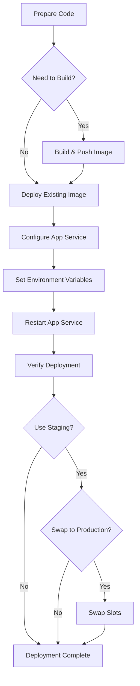

# Azure Deployment Workflow

This document describes the complete workflow for deploying the Clarus Mens API to Azure App Service \
using our automated deployment script.

## Table of Contents

- [Table of Contents](#table-of-contents)
- [Overview](#overview)
- [Prerequisites](#prerequisites)
- [Deployment Script](#deployment-script)
  - [Parameters](#parameters)
  - [Basic Usage](#basic-usage)
- [Common Deployment Scenarios](#common-deployment-scenarios)
  - [Initial Deployment](#initial-deployment)
  - [Updating an Existing Deployment](#updating-an-existing-deployment)
  - [Using Staging Slots](#using-staging-slots)
  - [Rolling Back to Previous Version](#rolling-back-to-previous-version)
- [Behind the Scenes](#behind-the-scenes)
- [Troubleshooting](#troubleshooting)
  - [Common Issues](#common-issues)
  - [Getting Help](#getting-help)
- [Azure Configuration Reference](#azure-configuration-reference)
  - [Critical Environment Variables](#critical-environment-variables)
  - [Container Registry Configuration](#container-registry-configuration)
  - [Optional Configuration Variables](#optional-configuration-variables)
  - [Azure Portal Configuration](#azure-portal-configuration)
    - [App Service Configuration in Azure Portal](#app-service-configuration-in-azure-portal)
    - [Container Registry Configuration](#container-registry-configuration-1)
    - [Deployment Slot Configuration](#deployment-slot-configuration)
  - [Verifying Configuration](#verifying-configuration)
- [Related Documents](#related-documents)
- [Automated Deployment Options](#automated-deployment-options)
- [Step 3: Run the Deploy-ToAzure.ps1 Script](#step-3-run-the-deploy-toazureps1-script)
  - [Script Parameters](#script-parameters)
- [Step 4: Verify Deployment](#step-4-verify-deployment)
- [Azure Configuration Validation](#azure-configuration-validation)
  - [Running Validation](#running-validation)
  - [What Gets Validated](#what-gets-validated)
  - [Validation Report](#validation-report)
  - [When to Use Validation](#when-to-use-validation)
- [Implementation Details](#implementation-details)

## Overview

Our deployment process uses the `Deploy-ToAzure.ps1` PowerShell script to automate the deployment of the \
Clarus Mens API to Azure App Service. The script handles:

1. Version determination from `Directory.Build.props`
2. Optional Docker image building and pushing
3. Azure App Service configuration
4. Critical environment variables setup
5. Deployment verification
6. Optional deployment slot usage and swapping



## Prerequisites

Before using the deployment script, ensure you have:

1. **Azure CLI** installed and authenticated
2. **Docker Desktop** installed (if building images locally)
3. **PowerShell 7+** installed
4. Proper Azure resources already set up:
   - Resource Group
   - App Service Plan
   - Web App
   - Azure Container Registry

For setting up these resources, see [Azure Deployment Walkthrough](azure-deployment-walkthrough.md).

## Deployment Script

The `Deploy-ToAzure.ps1` script is located in the `scripts` directory and provides a comprehensive solution \
for deploying to Azure.

### Parameters

| Parameter           | Type   | Description                                                             |
| ------------------- | ------ | ----------------------------------------------------------------------- |
| ResourceGroup       | string | Azure resource group name (default: "clarus-mens-rg")                   |
| AppName             | string | Azure web app name (default: "clarus-mens-app")                         |
| BuildImage          | switch | Flag to build and push Docker image before deployment                   |
| UseStaging          | switch | Deploy to staging slot instead of production                            |
| ImageTag            | string | Specific image tag to deploy (default: read from Directory.Build.props) |
| SwapAfterDeployment | switch | After deploying to staging, swap to production                          |
| Verbose             | switch | Show more detailed output                                               |

### Basic Usage

```powershell
# Deploy current version to production
.\scripts\Deploy-ToAzure.ps1

# Build image, then deploy to production
.\scripts\Deploy-ToAzure.ps1 -BuildImage

# Deploy to staging slot for testing
.\scripts\Deploy-ToAzure.ps1 -UseStaging

# Deploy to staging and swap to production after verification
.\scripts\Deploy-ToAzure.ps1 -UseStaging -SwapAfterDeployment

# Deploy a specific version
.\scripts\Deploy-ToAzure.ps1 -ImageTag v0.8.0
```

## Common Deployment Scenarios

### Initial Deployment

For the first deployment to a new Azure environment:

1. Create Azure resources using [Azure Deployment Walkthrough](azure-deployment-walkthrough.md)
2. Run with both build and deployment:

```powershell
.\scripts\Deploy-ToAzure.ps1 -BuildImage
```

### Updating an Existing Deployment

When you've made changes to the application and need to deploy an update:

1. Update version in `Directory.Build.props` using:

   ```powershell
   .\scripts\Update-Version.ps1 -VersionType patch
   ```

2. Build and deploy:

   ```powershell
   .\scripts\Deploy-ToAzure.ps1 -BuildImage
   ```

### Using Staging Slots

For safer deployments with pre-production validation:

1. Deploy to staging:

   ```powershell
   .\scripts\Deploy-ToAzure.ps1 -BuildImage -UseStaging
   ```

2. Verify the application works correctly at the staging URL
3. Swap to production manually or automatically:

   ```powershell
   # To swap after verification
   az webapp deployment slot swap --name clarus-mens-app --resource-group clarus-mens-rg \
   --slot staging --target-slot production
   
   # Or to deploy with automatic swap (after confirmation prompt)
   .\scripts\Deploy-ToAzure.ps1 -BuildImage -UseStaging -SwapAfterDeployment
   ```

### Rolling Back to Previous Version

If you need to revert to a previous version:

```powershell
# Deploy a specific previous version
.\scripts\Deploy-ToAzure.ps1 -ImageTag v0.8.0
```

## Behind the Scenes

The deployment script performs several important tasks:

1. **Authentication Verification**
   - Checks if you're logged into Azure CLI
   - Prompts for login if needed

2. **Resource Validation**
   - Verifies resource group, web app, and container registry exist
   - Creates staging slot if it doesn't exist when -UseStaging is specified

3. **Version Determination**
   - Reads from Directory.Build.props if no tag specified
   - Formats version as v0.9.0 for Docker tags

4. **Image Building** (if requested)
   - Logs into Azure Container Registry
   - Uses Build-DockerImage.ps1 script or fallback to direct Docker commands
   - Pushes the image to ACR

5. **App Service Configuration**
   - Sets container image using `az webapp config container set`
   - Configures critical application settings:
     - WEBSITES_PORT=80
     - ASPNETCORE_URLS=http://+:80
     - ASPNETCORE_ENVIRONMENT=Production
     - DOCKER_CUSTOM_IMAGE_NAME=[image name]
   - Restarts the app service

6. **Deployment Verification**
   - Checks the /health endpoint with retry logic
   - Attempts to access the /api/diagnostics endpoint
   - Reports deployment status

7. **Slot Swapping** (if requested)
   - Prompts for confirmation before swapping
   - Swaps staging slot to production

## Troubleshooting

### Common Issues

1. **Authentication Errors**
   - Run `az login` manually
   - Verify you have access to the resource group

2. **Container Registry Issues**
   - Ensure ACR credentials are correct
   - Try logging in manually: `az acr login --name clarusmenscr`

3. **Deployment Failures**
   - Check if the image exists in ACR
   - Verify app settings are correct
   - Check application logs: `az webapp log tail --name clarus-mens-app --resource-group clarus-mens-rg`

4. **Health Check Failures**
   - Give the application more time to start
   - Verify the health endpoint is implemented
   - Check detailed logs in Azure Portal

### Getting Help

For more information:

1. Check deployment logs created by the script
2. View application logs in Azure Portal
3. Check the [Troubleshooting section](azure-deployment-walkthrough.md#troubleshooting) in the deployment walkthrough

## Azure Configuration Reference

This section provides a comprehensive reference for Azure configuration settings required by the \
Clarus Mens API, including environment variables and their recommended values.

### Critical Environment Variables

These variables are essential for container deployment and are automatically set by the `Deploy-ToAzure.ps1` script:

| Variable                 | Value                                      | Purpose                                               |
| ------------------------ | ------------------------------------------ | ----------------------------------------------------- |
| WEBSITES_PORT            | 80                                         | Tells Azure which port to connect to inside container |
| ASPNETCORE_URLS          | http://+:80                                | Tells your application which port to listen on        |
| ASPNETCORE_ENVIRONMENT   | Production                                 | Sets the .NET environment                             |
| DOCKER_CUSTOM_IMAGE_NAME | clarusmenscr.azurecr.io/clarus-mens:v0.9.0 | Specifies container image                             |

### Container Registry Configuration

These variables are needed for Azure to authenticate with your container registry:

| Variable                            | Value                             | Purpose                    |
| ----------------------------------- | --------------------------------- | -------------------------- |
| DOCKER_REGISTRY_SERVER_URL          | <https://clarusmenscr.azurecr.io> | Registry URL               |
| DOCKER_REGISTRY_SERVER_USERNAME     | clarusmenscr                      | Registry username          |
| DOCKER_REGISTRY_SERVER_PASSWORD     | [your registry password]          | Registry password          |
| WEBSITES_ENABLE_APP_SERVICE_STORAGE | true                              | Enables persistent storage |

### Optional Configuration Variables

These variables provide additional customization for specific scenarios:

| Variable                                   | Recommended Value        | Purpose                                   |
| ------------------------------------------ | ------------------------ | ----------------------------------------- |
| ASPNETCORE_LOGGING__CONSOLE__DISABLECOLORS | true                     | Improves log readability in Azure         |
| APPLICATION_INSIGHTS_CONNECTION_STRING     | [your connection string] | Enables Application Insights monitoring   |
| WEBSITE_TIME_ZONE                          | W. Europe Standard Time  | Sets the timezone for logs and operations |

### Azure Portal Configuration

#### App Service Configuration in Azure Portal

> **Screenshot 1: Application Settings**
>
> *This screenshot should show the Application Settings section in the Azure Portal with all the environment \
> variables properly configured. Navigate to: App Service > Configuration > Application Settings.*

#### Container Registry Configuration

> **Screenshot 2: Container Settings**
>
> *This screenshot should show the Container Settings section with properly configured registry details. \
> Navigate to: App Service > Settings > Container > Registry settings.*

#### Deployment Slot Configuration

> **Screenshot 3: Deployment Slots**
>
> *This screenshot should show the Deployment Slots section with a properly configured staging slot. \
> Navigate to: App Service > Deployment > Deployment slots.*

### Verifying Configuration

To verify your configuration is correct:

1. Check application settings using Azure CLI:

   ```powershell
   az webapp config appsettings list --name clarus-mens-app --resource-group clarus-mens-rg
   ```

2. Check container settings:

   ```powershell
   az webapp config container show --name clarus-mens-app --resource-group clarus-mens-rg
   ```

3. Check the diagnostic endpoint after deployment:

   ```url
   https://clarus-mens-app.azurewebsites.net/api/diagnostics
   ```

4. Review the environment variables displayed in the diagnostic output to ensure they match expected values.

## Related Documents

- [Pre-Publishing Checklist](prepublishing-checklist.md) - Complete these steps before deployment
- [Azure Deployment Walkthrough](azure-deployment-walkthrough.md) - Historical walkthrough with lessons learned
- [Azure Deployment Planning Guide](azure-deployment-planning-guide.md) - Theoretical background on Azure deployment
- [GitHub Deployment Transition](github-deployment-transition.md) - Guide for transitioning to GitHub-based deployment
- [Publishing Checklist](publishing-checklist.md) - Manual deployment checklist for reference

## Automated Deployment Options

This document outlines our recommended workflow using the `Deploy-ToAzure.ps1` script. We offer two \
additional options depending on your needs:

1. [GitHub-based Deployment](github-deployment-transition.md): For team-based workflows with CI/CD
2. [Manual Deployment Steps](publishing-checklist.md): For reference or troubleshooting

For comprehensive guidance on version updates and deployment validation, refer to the \
[Version Update Checklist](version-update-checklist.md).

To ensure Azure App Service settings match expected values, we've implemented a validation feature in the \
`Deploy-ToAzure.ps1` script.

For a comprehensive version update process that includes validation, refer to our \
[Version Update Checklist](version-update-checklist.md).

## Step 3: Run the Deploy-ToAzure.ps1 Script

### Script Parameters

The script supports the following parameters:

- `-ResourceGroup`: The Azure resource group name (default: `clarus-mens-rg`)
- `-AppName`: The Azure App Service name (default: `clarus-mens-app`)
- `-BuildImage`: Build the Docker image before deployment
- `-PushToRegistry`: Push the Docker image to Azure Container Registry
- `-UseStaging`: Deploy to staging slot instead of production
- `-SwapAfterDeployment`: Swap staging to production after deployment
- `-Validate`: Validate Azure configuration after deployment

## Step 4: Verify Deployment

After deployment, verify that the application is working correctly:

1. Verify the application is accessible:

   ```url
   https://clarus-mens-app.azurewebsites.net/
   ```

2. Test endpoints using the HTTP request file:
   1. Open `ClarusMensAPI/api-manual-endpoint-requests.http`
   2. Change the active environment to Azure: `@ClarusMensAPI_HostAddress = {{azure}}`
   3. Send requests to test all endpoints:
      - Health check
      - Diagnostics endpoint
      - Version endpoint
      - API endpoints

3. Check the application logs:

   ```powershell
   az webapp log tail --name clarus-mens-app --resource-group clarus-mens-rg
   ```

4. Examine the diagnostic endpoint for runtime information:

   ```url
   https://clarus-mens-app.azurewebsites.net/api/diagnostics
   ```

## Azure Configuration Validation

To ensure Azure App Service settings match expected values, we've implemented a validation feature in the \
`Deploy-ToAzure.ps1` script.

### Running Validation

You can validate Azure settings with the `-Validate` parameter:

```powershell
# Validate existing configuration
.\scripts\Deploy-ToAzure.ps1 -Validate

# Deploy and validate in one step
.\scripts\Deploy-ToAzure.ps1 -BuildImage -PushToRegistry -Validate
```

### What Gets Validated

The validation process checks:

1. **App Settings**: Critical environment variables like `WEBSITES_PORT`, `ASPNETCORE_URLS`, etc.
2. **Container Registry Configuration**: Registry URL, username, and password existence
3. **Runtime Configuration**: Using the `/api/diagnostics` endpoint to validate runtime values
4. **Version Information**: Comparing deployed version with expected version

### Validation Report

The script generates a detailed validation report showing:

- Pass/fail status for each setting
- Overall validation score
- Suggestions for fixing any issues

### When to Use Validation

- After initial deployment to verify proper configuration
- After making configuration changes in Azure Portal
- When troubleshooting application issues
- As part of your regular version update process

For a comprehensive version update process that includes validation, refer to our \
[Version Update Checklist](version-update-checklist.md).

## Implementation Details
