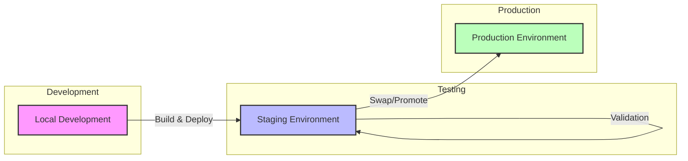

# Staging Environment Implementation Guide

> **Note**: This document outlines a future enhancement for the Clarus Mens deployment process,
> adding a staging environment to improve release quality and reduce production risks.

## Table of Contents

- [Table of Contents](#table-of-contents)
- [Overview](#overview)
- [Benefits](#benefits)
- [Implementation Options](#implementation-options)
  - [Azure Deployment Slots](#azure-deployment-slots)
  - [Separate App Service](#separate-app-service)
  - [Container Environment Variables](#container-environment-variables)
- [Implementation Steps](#implementation-steps)
- [Code Considerations](#code-considerations)

## Overview

A staging environment provides a pre-production testing area that closely mirrors the production \
environment. This allows for final validation of application changes before they reach end users, \
reducing the risk of production issues and enabling more sophisticated deployment strategies.



## Benefits

1. **Risk Reduction**:
   - Test in an environment identical to production
   - Identify configuration issues before they affect users
   - Validate integration with external services

2. **Deployment Flexibility**:
   - Enable blue-green deployment patterns
   - Achieve near-zero downtime during updates
   - Simplify rollback procedures

3. **Process Improvements**:
   - Enable UAT (User Acceptance Testing) in a production-like environment
   - Allow performance testing under realistic conditions
   - Increase confidence in releases

4. **Testing Quality**:
   - Test with production-like data volumes and patterns
   - Validate environment-specific settings
   - Test infrastructure in addition to application code

## Implementation Options

### Azure Deployment Slots

**Recommended Approach**

Azure App Service deployment slots provide a native way to implement staging environments with minimal overhead.

**Key Features**:

- Share the same App Service Plan resources
- Support easy swapping of slots with zero downtime
- Maintain independent configuration per slot
- Allow slot-specific application settings

**Considerations**:

- Requires Basic tier or higher App Service Plan
- Shares underlying VM resources with production
- Warming may be needed after slot swaps

### Separate App Service

**Alternative Approach**

Creating a completely separate App Service instance provides full isolation but increases costs and complexity.

**Key Features**:

- Complete resource isolation from production
- Independent scaling and monitoring
- Can use a different (lower) pricing tier than production

**Considerations**:

- Higher cost due to additional App Service instance
- Requires more management overhead
- No native promotion mechanism

### Container Environment Variables

**Simplest Approach**

Using the same container image with different environment variables offers the simplest implementation.

**Key Features**:

- Same container image for all environments
- Different behavior controlled by ASPNETCORE_ENVIRONMENT
- Minimal additional infrastructure

**Considerations**:

- Limited isolation from production
- Requires careful configuration management
- May not catch all environment-dependent issues

## Implementation Steps

1. **Create a Staging Slot**:

   ```powershell
   az webapp deployment slot create --name clarus-mens-app --resource-group clarus-mens-rg --slot staging
   ```

2. **Configure Slot-Specific Settings**:

   ```powershell
   az webapp config appsettings set --name clarus-mens-app --resource-group clarus-mens-rg --slot staging --settings ASPNETCORE_ENVIRONMENT=Staging
   ```

3. **Deploy to Staging First**:

   ```powershell
   # Deploy the container to staging
   az webapp config container set --name clarus-mens-app --resource-group clarus-mens-rg --slot staging --docker-custom-image-name clarusmenscr.azurecr.io/clarus-mens:v0.9.0
   ```

4. **Test and Validate**:
   - Run comprehensive tests against the staging URL
   - Verify all functionality works as expected
   - Check logging and monitoring

5. **Swap to Production**:

   ```powershell
   az webapp deployment slot swap --name clarus-mens-app --resource-group clarus-mens-rg --slot staging --target-slot production
   ```

## Code Considerations

1. **Configuration Handling**:
   - Add a `appsettings.Staging.json` file:

   ```json
   {
     "Logging": {
       "LogLevel": {
         "Default": "Information",
         "Microsoft.AspNetCore": "Warning"
       }
     }
   }
   ```
